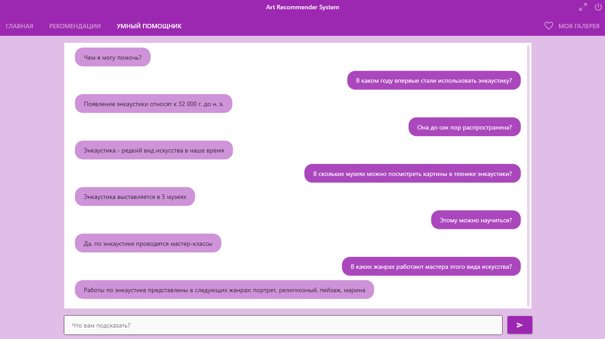
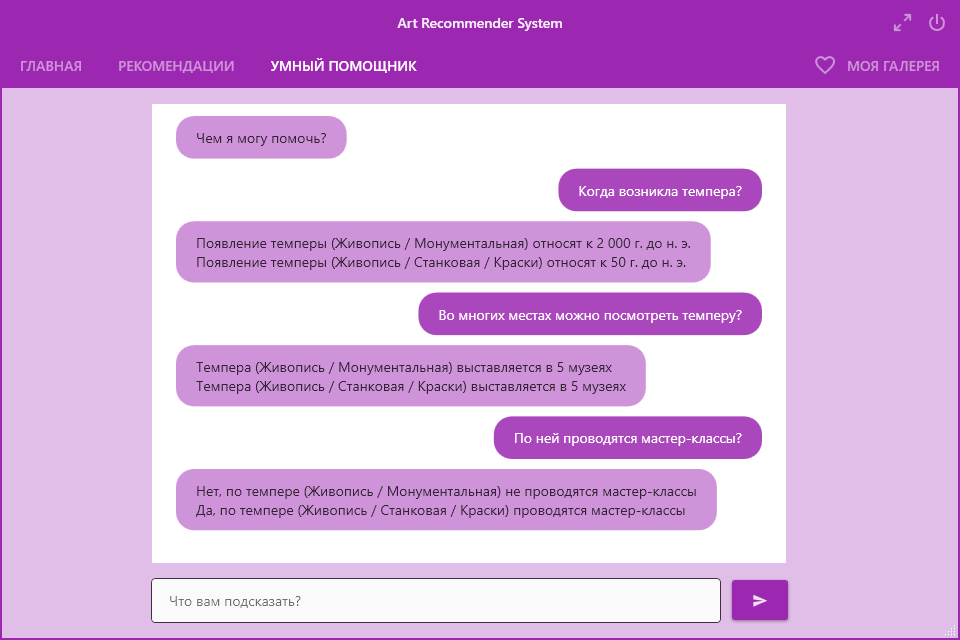
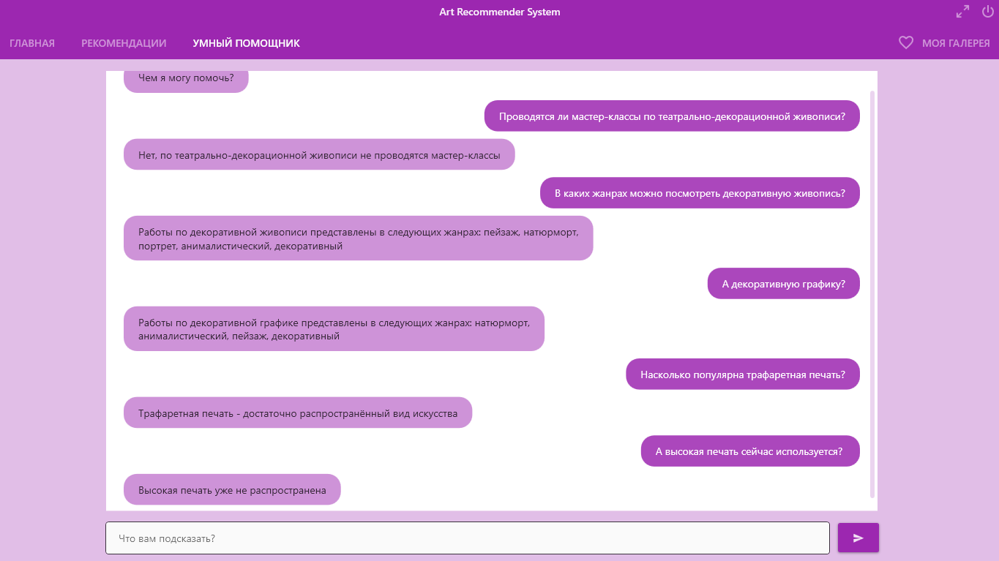
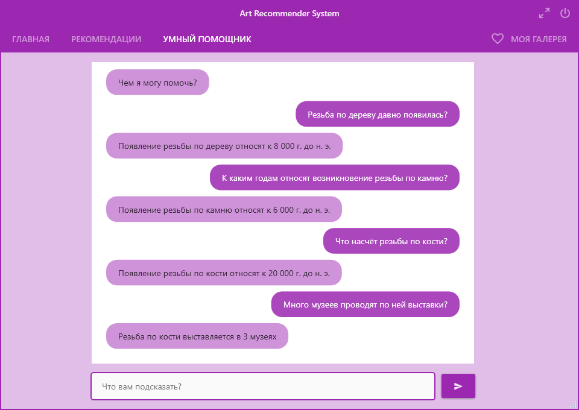
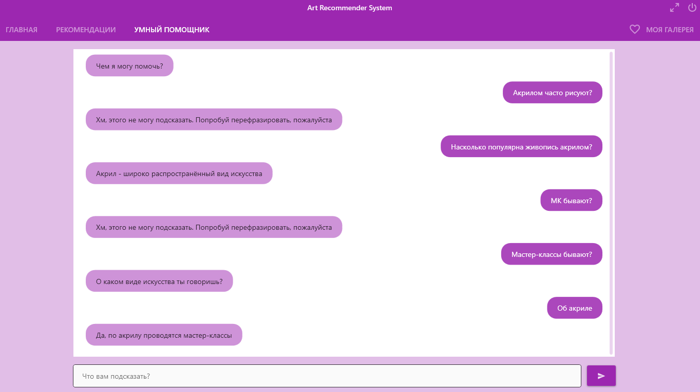

# ArtRecommenderSystem

**Art Recommender System** представляет собой рекомендательную систему, в которой используется подходы коллаборативной фильтрации, контент-ориентированной фильтрации и парметрического запроса.
 
 ## Главная страница
 После запуска программы открывается главная страница программы, на которой представлен весь список видов искусства. Информация о каждом виде искусства представлена в виде карточки. Она содержит наименование вида искусства, категорию, к которой он относится, дату его первого упоминания, количество музеев, информацию о проводимых мастер-классах, популярность в настоящее время и список жанров, в которых работают представители данного вида искусства.

 ## Избранное
Нажав на кнопку "Нравится", пользователь может добавить понравившиеся виды искусств в список "Избранное". Вкладку "Избранное" можно найти на странице "Моя галерея". При повторном клике на кнопку "Нравится" вид искусства удаляется из списка.

 ## Рекомендации
 Рекомендации выдаются на основе избранных видов искусства, поэтому для их получения пользователю нужно добавить хотя бы один вид искусства в "Избранное".
 
 На странице "Рекомендации" можно выбрать механизм подбора рекомендаций: **коллаборативная фильтрация** или **контент-ориентированная фильтрация**.
 
 **При выборе коллаборативной фильтрации** пользователю будут выданы **предпочтения пользователей с похожими интересами**. Данный алгоритм фильтрации основан на показателе сходства между пользователями. Всех пользователей можно условно разделить на группы на основе их предпочтений и рекомендовать им виды искусств той группы, к которой они принадлежат. По алгоритму сначала отбираются пользователи, у которых число совпадений в предпочтениях с текущим пользователем максимально. Затем их предпочтения объединяются и выдаются в рекомендациях. Интересы наиболее похожих пользователей, чьи предпочтения были рекомендованы, можно увидеть вверху окна. Чем больше видов искусства добавлено в "Избранное", тем точнее будут рекомендации и меньше будет список интересов.

**При выборе контент-ориентированной фильтрации** пользователь увидит **рекомендации на основе своих предпочтений**, то есть получит список искусств, наиболее похожих на те, которые он ранее добавил в "Избранное". Данный алгоритм использует меры близости для вычисления сходства. В качестве метрик были выбраны евклидово расстояние и близость по дереву, при этом значение первой метрики в итоговом значении сходства составляет 70%, а второй - 30%. Для всех понравившихся видов искусства вычисляется сходство с другими видами, не добавленными в "Избранное". Затем для каждого не отмеченного лайком искусства подсчитывается суммарное сходство со всеми избранными. В полученном списке отбираются те искусства, у которых итоговое значение сходства было выше установленного порога в 50%. Пользователю выдаются эти виды искусств в порядке убывания сходства.

## Чёрный список
Если какие-то из предложенных видов искусств не входят в интересы пользователя, он может нажать "Не рекомендовать". Тогда эти виды искусства тут же удалятся из списка, будут добавлены в "Черный список" и больше не будут появляться в рекомендациях. "Черный список" можно найти на странице "Моя галерея". При повторном клике на кнопку "Не рекомендовать" вид искусства исчезнет из списка.

 

## Параметрический поиск
Если пользователь хочет подобрать виды искуссва, удовлетворяющие определённым параметрам, он может воспользоваться функцией "Параметрический поиск" на главной странице программы. При этом откроется дополнительная панель с фильтрами для задания даты первого упоминания, количества музеев, наличия мастер-классов, популярности и списка жанров. После установки необхомых значений и нажатия кнопки "Фильтровать" пользователь увидит виды искусств, которые удовлетворяют заданным критериям (причём каждый найденный вид искусства будет содержать все отмеченные жанры, один из видов популярности и одно из значений наличия мастер-классов).

Если по запросу пользователя ничего не нашлось, он получит близкие к установленным параметрам виды искусств. Это достигается за счёт расширения значений тех фильтров, в которых указывается диапазон (первое упоминание и количество музеев). Например, в данном случае были изменены границы диапазона количества музеев.

Границы диапазонов двух фильтров изменяются равномерно и поочерёдно, то есть за каждую итерацию поиска изменяется только один фильтр. Изначально рассчитывается максимальное число итераций поиска, необходимое для полного покрытия каждого из диапазонов. Затем находится общее число итераций и вычисляется частота изменения каждого фильтра. Итерации распределяются между фильтрами в порядке возрастания их частоты. Так как фильтра диапазонов всего два, то сначала итерации будут выделяться менее частотному фильтру, причём номер итерации кратен его частоте, а затем оставшиеся будут назначены второму фильтру. За каждый шаг диапазон количества музеев расширяется на единицу вверх и вниз, а границы диапазона дат первого упоминания - на половину текущего, следующего или предыдущего периода (в зависимости от того, в какой половине периода находился текущий год).

Если после итерации был найден хотя бы один вид искусства, поиск прекращается. Если было найдено больше одного вида искусства, то они будут отранжированы с учётом их близости к исходным фильтрам. Для этого применяется функция, которая рассчитывает оценки отличия от значений исходных фильтров. Она определяет доли выхода за границы каждого из диапазонов, суммириует их и сортирует список видов искусства по возрастанию полученных оценок. Таким образом, пользователю выдаётся список, в котором первыми отображаются те виды искусства, у которых общий выход за границы диапазонов был меньше, а значит, они больше подходили под начальные критерии поиска.

По следующему примеру видно, что первым отображается вид искусства, у которого в исходные диапазоны не попало только количество музеев, вторым - у которого выход за границы числа музеев такой же, однако есть ещё небольшой выход за диапазон дат, а последующие виды искусства, имея аналогичный выход за границы первого фильтра, имеют уже гораздо больший выход за границы значений второго.

## Умный помощник

В рекомендательную систему также встроен умный помощник, которому можно задать вопросы о каком-либо виде искусства и быстро получить ответ, не тратя время на его поиск на главной странице.

### Возможности помощника:

- **Навык "Год первого упоминания":**
  - *пример вопросов*:
    - Когда начали использовать акварель?
    - В каком году впервые стали применять тушь?
    - Вязание давно появилось?
    - Назови год первого упоминания фрески
  - *пример ответа*
    - Появление фрески относят к 1 700 г. до н. э.
 
- **Навык "Количество музеев":**
  - *примеры вопросов:*
    - Сколько музеев выставляют картины, написанные акрилом?
    - Во многих местах можно посмотреть мозаику?
  - *пример ответа*
    - Мозаика выставляется в 7 музеях
    
- **Навык "Проведение мастер-классов":**
  - *примеры вопросов:*
    - Плетению можно научиться?
    - По объёмному проектированию проводятся мастер-классы?
  - *примеры ответов*
    - Да, по плетению проводятся мастер-классы
    - Нет, по объёмному проектированию не проводятся мастер-классы

- **Навык "Популярность искусства":**
  - *примеры вопросов:*
    - Насколько популярна театрально-декорационная живопись?
    - Сейчас рисуют энкаустикой?
    - Высокая печать до сих пор используется?
    - Насколько распространён декупаж?
  - *примеры ответов*
    - Театрально-декорационная живопись - достаточно распространённый вид искусства
    - Энкаустика - редкий вид искусства в наше время
    - Высокая печать уже не распространена
    - Декупаж - широко распространённый вид искусства

- **Навык "Жанры искусства":**
  - *пример вопроса:*
    - В каких жанрах работают мастера барельефа?
  - *пример ответа*
    - Работы по барельефу представлены в следующих жанрах: исторический, религиозный, мифологический, бытовой, портрет, анималистический, пейзаж, архитектура

Пример диалога с умным помощником представлен на следующем скриншоте.

### Принцип работы

**Обработка вопроса** пользователя в диалоговой системе происходит следующим образом:
1. **Графематический анализ.** Вопрос пользователя разбивается на слова на основе определённых символов-разделителей. При этом нужно учитывать, что среди наименований видов искусств есть такие, которые содержат в себе дефисы (театрально-декорационная живопись). Так как часто при печати используется именно символ дефиса, а не тире, то список символов-разделителей было решено заменить на список строк-разделителей, где одним из значений будет " - " (дефис с пробелами по бокам). Таким образом, на выходе наименования видов искусства, содержащих дефисы в своем составе, будут одним словом.

2. **Морфологический анализ.** Для проведения морфологического анализа использовалась [библиотека DeepMorphy](https://github.com/lepeap/DeepMorphy "Репозиторий DeepMorphy") (морфологический анализатор для русского языка на C# для .NET), которая позволяет выполнять следующие действия:
   - проводить морфологический разбор слова (определяет часть речи, род, число, падеж, время, лицо, наклонение, залог);
   - приводить слова к нормальной форме;
   - менять форму слова в рамках лексемы.

   На этом этапе для каждого слова из вопроса пользователя будет выполнен морфологический разбор и получена лемма, то есть нормальная форма слова.

3. **Синтаксический анализ.** Так как вопросы являются достаточно простыми фразами, в которых по одному-двум словам можно понять, что спрашивают и какой ожидается ответ, то данный этап был опущен.

4. **Семантический анализ.** На этом этапе необходимо определить смысл вопроса.  
Здесь необходимо выполнить **2 задачи**:
   - определить тематику вопроса;
   - выяснить, о каком виде искусства спрашивают.

**Для выполнения первой задачи** для каждой тематики был создан **словарь ключевых слов**, по которым можно определить принадлежность вопроса к данной теме. Например, для того чтобы узнать год первого упоминания вида искусства, можно задать такие вопросы:
  - Когда начали использовать акварель?
  - В каком году впервые стали применять тушь?
  - Вязание давно появилось?
  - Назови год первого упоминания фрески
  
  Таким образом, вероятнее всего в вопросе о дате встретятся следующие слова: "год", "когда", "впервые", "упоминание", "появиться". Все они были добавлены в словарь ключевых слов в нормальной форме, так как сравнение будет происходить именно в ней. Каждое слово из вопроса проверяется на вхождение в словарь ключевых слов. Если оно вошло в какой-то из словарей, тема определена.

**Задача определения вида искусства**, о котором спрашивают в вопросе, состоит в идентификации наименования искусства по одному слову (существительное), двум словам (прилагательное + существительное), и по трем словам (существительное + предлог + существительное).

- Если наименование вида искусства **состоит из одного слова**, то оно может быть просто найдено среди списка названий всех видов искусства. При этом будет сравниваться нормальная форма слова. Однако следует учесть один момент: наименования некоторых видов искусства совпадают, при этом они относятся к разным подвидам или родам (темпера - вид одновременно монументальной и станковой живописи, витраж - вид монументальной живописи и вид декоративно-прикладного искусства). Вариант уточнения, возможно, был бы и лучшим решением, однако на данном этапе было решено выдавать ответы сразу по двум видам искусства.

 
 

- Если же наименование вида искусства **представляет собой словосочетание**, состоящее **из прилагательного и существительного**, как например, "декоративная графика", "трафаретная печать", "круглая скульптура", "миниатюрная живопись", то нахождение одного существительного среди наименований видов искусства уже становится недостаточным. Так, например, помимо миниатюрной живописи, есть ещё декоративная, а помимо трафаретной печати, есть ещё высокая, плоская и глубокая. Таким образом, если было найдено существительное, которое составляет только часть наименования искусства (нескольких наименований), то будет проверена часть речи предыдущего слова. Если это прилагательное, то оно будет приведено к форме того рода, в котором стоит существительное, и повторно будет сравниваться со всеми найденными вариантами.

- Если же наименование вида искусства **состояло из трёх слов: двух существительных, соединенных предлогом** ("резьба по дереву", "резьба по кости", "резьба по камню"), - будет применен следующий подход. В этом случае существительное так же, как и в предыдущем случае, будет составлять только часть наименования искусства (нескольких наименований), при этом оно уже будет стоять не в конце названия, а в начале. После неуспешной попытки найти словосочетание из прилагательного и существительного среди наименований видов искусства, будут при наличии взяты следующие два слова. Первое найденное существительное будет стоять в нормальной форме, а следующие два в такой, в которой звучали в вопросе.

 
 

 
Если после прохождения по массиву слов вопроса его тематика или запрашиваемый вид искусства не были определены, то будет предпринята попытка **получить их из контекста**. После каждого вопроса тематика и вид искусства запоминаются, поэтому при необходимости недостающая информация может быть подставлена из контекста в текущий вопрос, что было продемонстрировано на предыдущих скриншотах.

Если **вопрос не удалось обработать**, диалоговая система попросит переформулировать вопрос.

**Построение ответа на вопрос** (синтеза текста) складывается из тех же этапов обработки вопроса (обработки текста), следующих, однако, в обратном порядке. На семантическом этапе должны быть получены запрашиваемые данные определенного вида искусства (например, дата первого упоминания). На синтаксическом - строится дерево зависимостей (так как в вопросе спрашивается какое-либо одно сведение, то этот этап также пропускается). На морфологическом этапе слова ставятся в нужную форму, а на графематическом - образуется итоговый текст (ответ на вопрос).
